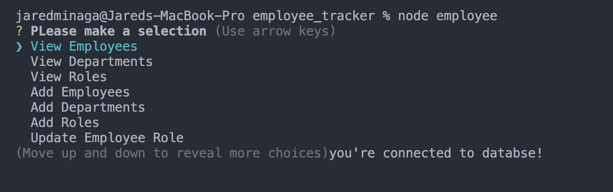
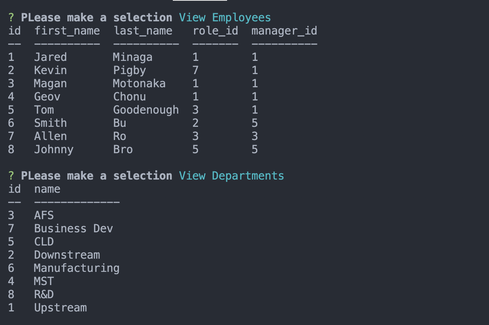
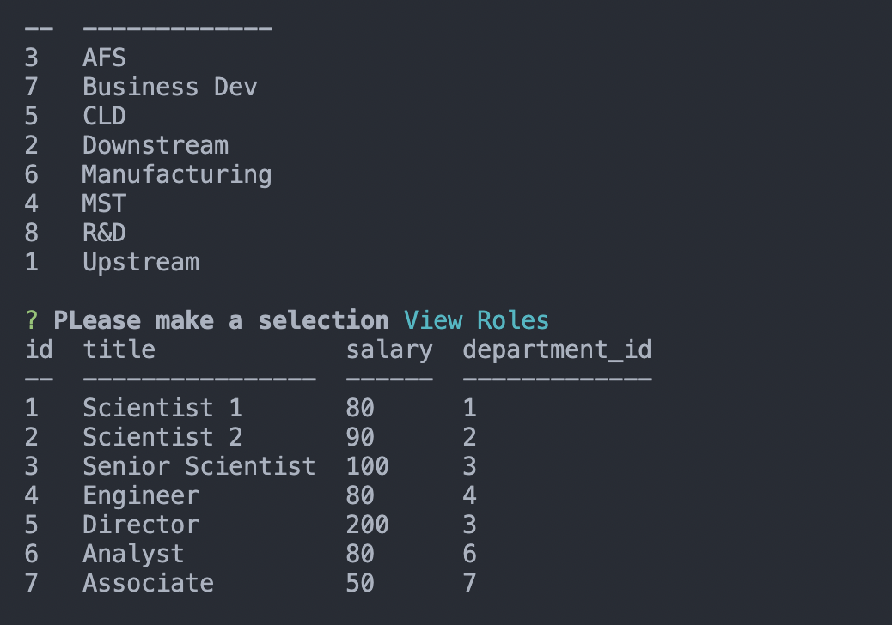

# employee_tracker

  This project was to create a CLI app using Inquirer and MySQL.
  The user will be able to view employees, roles, and departments.
  The user will be able to add employees, roles, departments, and update employees roles.

# Attributes

  When the user starts the app by using 'node employee' in their command line the app will start
  When the user makes a selection they will be able to view a table of employees, roles, and departments
  The department shows the department name
  The roles shows the role title, salary, and department id,
  The employees shows the first name, last name, title, and manager id.
# Links
  Video demo can be found here:
https://watch.screencastify.com/v/2SarRfB8c5B5HNNIbpZE

# Technologies

  JavaScript
  Inquirer
  MySQL
  MySQL Workbench
  console.table

# Screen Shots

